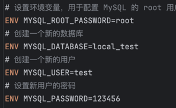

在dockerfile所在目录中执行如下命令

Docker builds build -t local_mysql .

-t local_mysql是命名镜像名称
. 是表示用当前目录的dockerfile

生成镜像后执行创建容器命令

docker run -d -p 3306:3306 --name local_mysql local_mysql

初始账号密码已经在dockerfile中定义

