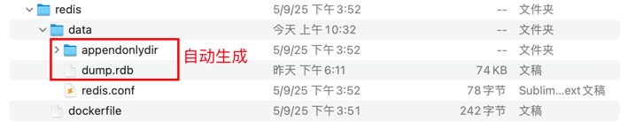

创建dockerfile，其中设置持久化挂载目录为同级目录下的data文件

同时在data文件夹中创建redis.conf文件作为默认配置文件

默认配置文件中定义requirepass为默认密码

整个文件目录结构如下



#### 开始创建redis镜像

```bash


docker build -t my-redis:v1.0 .

```


#### 启动容器
```bash

docker run -d \
  --name redis-prod \
  -p 6379:6379 \
  -v ./data:/data \
  -e REDIS_PASSWORD=1234567 \
  my-redis:v1.0
  

```


#### 安装redis-cli
```bash

# 安装 Homebrew（若未安装）
/bin/bash -c "$(curl -fsSL https://raw.githubusercontent.com/Homebrew/install/HEAD/install.sh)"  # 网页1
# 安装 Redis 工具集（含 redis-cli）
brew install redis  # 网页1][网页6
# 验证安装
which redis-cli  # 输出路径如 /opt/homebrew/bin/redis-cli

```


#### 安装redis insight
https://redis.io/insight/#insight-form